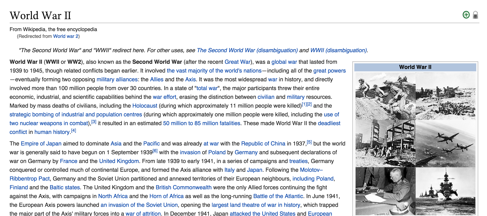

# sulky 

sulky is a information manipulation framework for writers and thinkers. sulky allows you to organise ideas, thoughts, lists, information, and manipulate them. sulky lets you play with information programatically and visually, using arbitrarily defined units of information as building blocks for creative works. 

Thus, “sulky” is two things: 

1. a framework for organising information; and 
2. a [free software](http://www.fsf.org/) tool, written in JavaScript, that is an implementation of the framework and a proof-of-concept.

# The problems sulky solves

## The film conversation problem

You've seen a lot of films. You like some of them. You want to talk about them to people you meet? How do you do it? You realise that movies fall into certain stylistic groups. Films are [remixed](http://everythingisaremix.info/) from each other, and depend on each other in interesting ways.

In other ways, the *metadata* of the films is what defines your contribution to this conversation. 

So if you want to capture the essence of every serious conversation about films, you can't just make a list of the movies you've seen/liked. That isn't enough. What we need is a data structure that can capture:

* the relationships between movies (derivations, etc)
* the temporal order they came out in
* the temporal order *you* saw them in
* a ranking system
* a categorisation system

`sulky` solves these problems. 

## The Wikipedia problem

Let's look at the Wikipedia article on [World War 2](https://en.wikipedia.org/wiki/World_War_II):

This is a disaster. I get a wall of text, and nothing is really clear. What I want (especially when I'm reading a new topic) is for information to be **presented hierarchically** 

I want to know the most important facts about the topic first, and then the less important facts, then the details and the nuances. 

This has the added advantage of respecting the reader, and making reading **interactive**:

If I want to spend 30 seconds on this topic (because I don't know if I'm interested in it or not), I get a small nugget of factoids that whets my appetite (and also comprises the most important facts about this topic). 

If I want to spend an hour on this topic, I get a different, longer text that is more comprehensive.

And finally, if I want to spend the rest of the day on World War 2, I get an truly encyclopaedic version of events. 

This **hierarchy of facts** has a beautiful visual metaphor: zoom. We should be able to *see* a concept or an idea from 30,000 feet, and understand it in its essence. As we *zoom in*, we should get a progressively richer and more detailed understanding of the concept. 

`sulky` aims to do that. It uses *zooming* in and out to sculpt text into long or short bits, to match the grain of information to suit the desires of the reader.

This idea is heavily influenced by Sublime Text's awesome [minimap](http://ergoemacs.org/emacs/proper_way_to_use_Sublime_Text_minimap.html), and by [Bit of News](http://bitofnews.com/about/) 

## The autobiography problem

# Philosophy 

## A book is a programme 

## Prepare for the singularity 

## Knowledge is structured

# Inspiration 

* [Pollen Pub](http://pollenpub.com/)
* [Learnable Programming](http://worrydream.com/#!/LearnableProgramming)
* [Media for Thinking the Unthinkable](http://worrydream.com/#!/MediaForThinkingTheUnthinkable)
* [The humane representation of thought](http://worrydream.com/#!/TheHumaneRepresentationOfThoughtTalk)
